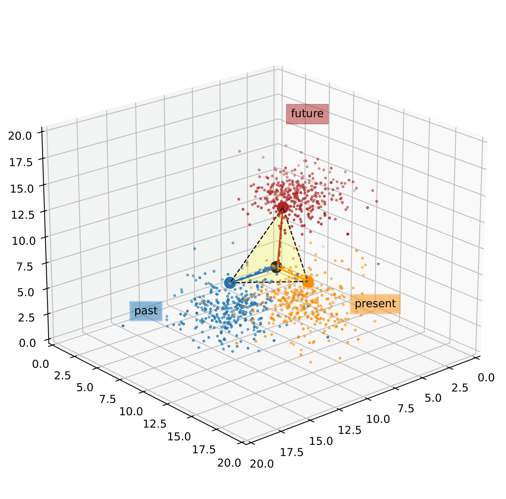
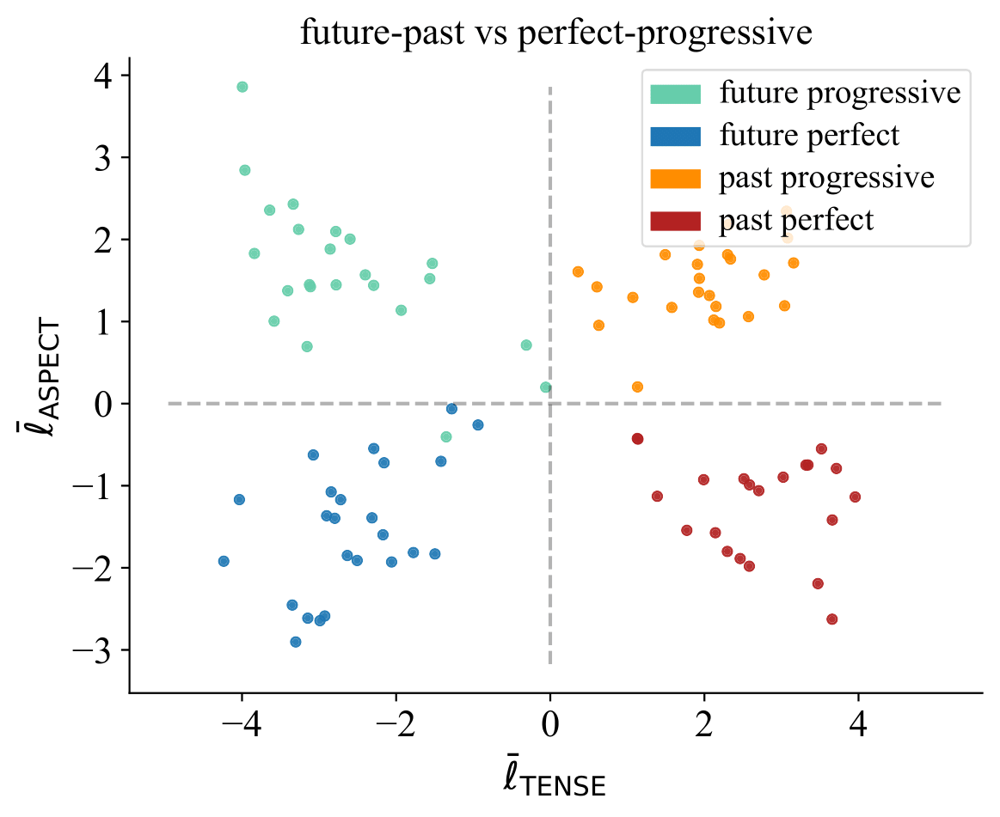

# Grammatical Tense and Aspect Representations in LLMs

This repo contains code for **Steering Language Models in Multi-Token Generation: A Case Study on Tense and Aspect (2025)**.

We explore how LLMs internally encode and control complex grammar features like tense and aspect using linear discriminant analysis and concept steering for causal verification. Our findings reveal structured, human-like representations and highlight key factors for minimizing side effects during controlled generation.

 


## Usage
### 1. Preliminaries

#### Model Selection
For working with a new model, create a new config file in `configs/` with the link to Huggingface, preferred model name for this project and specification of layer names. 

#### Data Preparation
For extracting tense and aspect feature directions, we use labeled data from Propbank [[1]](http://www.lrec-conf.org/proceedings/lrec2002/pdf/283.pdf), complemented with LLM-generated synthetic samples. The former can be downloaded and preprocessed with

```bash
python parse_propbank.py
```

It will be stored in `data/raw_data`, which already contains the synthetic samples.  

For evaluation, we leverage the tense subset from BIG-bench [[2]](https://github.com/google/BIG-bench/tree/main/bigbench/benchmark_tasks/tense). Download the json-file from there and preprocess the data with `parse_bigbench.py`.

[[1]](http://www.lrec-conf.org/proceedings/lrec2002/pdf/283.pdf) Kingsbury, Paul R., and Martha Palmer. "From TreeBank to PropBank." LREC. 2002.  
[[2]](https://github.com/google/BIG-bench/tree/main/bigbench/benchmark_tasks/tense) Logeswaran, Lajanugen, Honglak Lee, and Samy Bengio. "Content preserving text generation with attribute controls." Advances in Neural Information Processing Systems 31 (2018).

### 2. Extract Hidden States
Extract activations for train & test dataset and save them for reuse.

```bash
python extract_hidden.py <model_name>
```

### 3. Training of Probing Classifiers
Train probes on extracted activations, one per target tense/aspect/full tense.

```bash
python probing.py <model_name>
```

### 4. Extract Feature Directions
To perform LDA and extract feature directions we use code based on [KihoPark/LLM_Categorical_Hierarchical_Representations](https://github.com/KihoPark/LLM_Categorical_Hierarchical_Representations/tree/main), from their [paper](https://arxiv.org/abs/2406.01506).

```bash
python extract_sv.py <model_name>
```

### 5. Steering Tasks
Perform and evaluate steering on different tasks.   

#### Steering Hyperparameters
Export information about best layers for probing to steering config:

```bash
python export_best_probes.py <model_name>
```
Then add grid search range for few-shot and random sentence task (i.e., layers to steer, steering strength) in `hyperparams_steering.json` manually.

#### Steering Methods
Possible steering methods, specified via `file_suffix`  
- final_token_greedy
- final_token_greedy_fixed -> standard setting used for gridsearch experiments in paper
- final_token_nongreedy_fixed
- first_token_greedy
- first_token_greedy_fixed
- first_step_only
- decreasing_intensity
- every_second_step
- subtract_and_add
- subtract_and_add_nongreedy
- subtract_proj


#### Random Sentence Task
Perform steering on random sentence task.

```bash
python steering_random_sentence_task.py <model_name> <batch_size> <file_suffix>
```

#### Few-Shot Tasks

Perform steering on one of two few-shot tasks (i.e. `repetition` or `translation`) using one of two prompt formats (prompt format used in experiments: `a`). Test data is created based on the steering target, which can be either `tense` or `aspect`. 

```bash
python steering_few_shot_tasks.py <model_name> <batch_size> <file_suffix> <task> <prompt_style> <target>
```

## Citation
Our code is licensed under the MIT license. If you use this code, please cite the following paper: **Steering Language Models in Multi-Token Generation: A Case Study on Tense and Aspect**.

